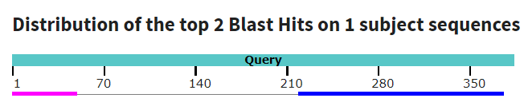

# Issues

This is a list of issues that I have encountered while working on this project. _Started in 4/10/2024 9:07 PM_

## Pangenome pipeline:

### Coding issues - errors:
- [X] Error first time running `workflow.sh`: 
resolved first by running it from `code/` as a working directory and uncommenting the download and clustering steps in order to download the CDS from PATRIC and run CD-HIT -> get output files
- [X] Error first time workflow reaches running eggNOG-mapper: 
error was coming from DIAMOND database: _[github issue](https://github.com/eggnogdb/eggnog-mapper/issues/397)_
`DIAMOND database /home/rayane/miniconda3/lib/python3.12/site-packages/data/eggnog_proteins.dmnd not present. Use download_eggnog_database.py to fetch it`
first needed to make sure the dependencies were downloaded, ran `which emapper.py`; there is no `download_eggnog_database.py` however, it's now called `download_eggnog_data.py` and is located in the same directory as `emapper.py`
after running `download_eggnog_data.py` the error was resolved.
- [X] Error first time workflow runs the `emapper.py` command:  _[github issue](https://github.com/bbuchfink/diamond/issues/363)_
`Error running diamond: Building reference seed array... Killed`  
Was only resolved once by deleting over 10GB files from the system and running the command again.
Running on _Pseudomonas aeruginosa_ dataset regave the error with no more large files to remove
- [X] Error first time performing fischer test: 
append in pandas library is deprecated - [stackoverflow](https://stackoverflow.com/questions/70837397/good-alternative-to-pandas-append-method-now-that-it-is-being-deprecated)
concat isnt available as well (was working on pandas 2.2.1)
Error resolved by downgrading pandas to the last version that had the append method: `pip install pandas==1.5.3`

### Logical issues:
- [ ] Many genome IDs missing; add new ids when downloading
- [ ] Cluster to gene mapping:
  - [X] For each cluster in the .clstr match it to the representative gene (one with *); based on its identifier match it with a product name from the .fasta file
  - [ ] Find a way to map product name to gene name - using the identifier, through patric, no gene name is found
- [ ] Clusters have duplicates: several clusters have the same product  
Looking at unique product names out of `8021` clusters, there are `1747` unique products
Took 2 sequences from the fasta matching for _Multidrug efflux system, inner membrane proton/drug antiporter (RND type) => CmeB_ and performed alignment in BLASTp
96.00% identity (query: , subject: )



It's clearly the same gene; 
issue from cd-hit even though % id was set at 0.8 when it's 0.9 by default

- [ ] Clusters have many hypothetical gene: `2860`  out of `8021`  
- [ ] Most are unique ~ `5671`

## Validation

- [X] Find ARGs from biological databases:
PATRIC has speciality genes, for AMR from CARD, NDARO and PATRIC as sources
e.g., 
```
genome_id="195.2069"
AMR_db="CARD"
drug="ciprofloxacin"
https://www.bv-brc.org/view/Genome/{genome_id}#view_tab=specialtyGenes&filter=and(eq(property,%22Antibiotic%20Resistance%22),eq(source,%22{AMR_db}%22),eq(antibiotics,%22{drug}%22))
```

_check if it can be done for the whole speciees_ - 195 for _Campylobacter coli_

- [ ] Know how to use bv-brc data API to get the data

## Gene-gene interactions