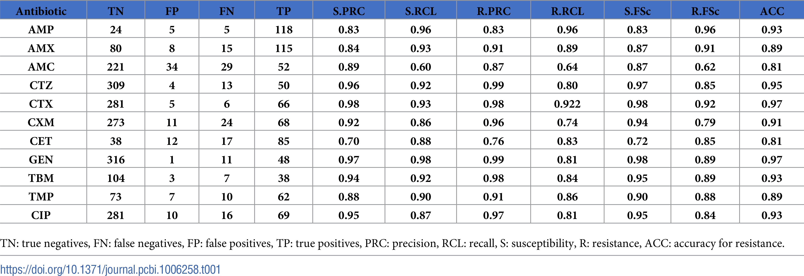

# AMR
_date: 1/28/2024 5:23PM_  
[_Mendeley paper collection_](https://www.mendeley.com/reference-manager/library/collections/0920c7ef-c6a5-49de-92f5-e77c01a8b5da/all-references/)

## Prediction in the lit

[Antimicrobial Resistance Prediction in PATRIC and RAST](https://www.nature.com/articles/srep27930)

### Reviews

- [Machine Learning for Antimicrobial Resistance Prediction: Current Practice, Limitations, and Clinical Perspective](https://journals.asm.org/doi/full/10.1128/cmr.00179-21)
- [A review of artificial intelligence applications for antimicrobial resistance](https://mednexus.org/doi/full/10.1016/j.bsheal.2020.08.003#sec-2)
- [Genome-Wide Association Studies (GWAS) Approaches for the Detection of Genetic Variants Associated with Antibiotic Resistance: A Systematic Review](https://www.ncbi.nlm.nih.gov/pmc/articles/PMC10745584/)
- [Genome-Based Prediction of Bacterial Antibiotic Resistance](https://journals.asm.org/doi/full/10.1128/jcm.01405-18)

| Authors | Year | Organism | Samples | Phenotype Resistance | Traits | Genetic Variants | GWAS Software | GWAS Approach | Population Structure Control |
|---------|------|----------|---------|----------------------|--------|------------------|---------------|---------------|------------------------------|
| [14]    | 2013 | Escherichia coli | 164 | FQ (CIP, GAT, LEV, NOR) | Binary | Genes | Not reported | Arbitrary set arithmetic between the pools based on their phenotypes to enrich for alleles that are linked to a specific phenotypic trait | Not reported |
| [15]    | 2014 | Staphylococcus aureus | 75 | VAN | Binary and Continuo | SNP | ROADTRIPS (binary phenotypes), QROADTRIPS (continuous phenotype), R (method similar to PhyC) | Regression Models; Phylogenetic | Covariance matrix; Phylogenetic Inference |
| [16]    | 2014 | Mycobacterium tuberculosis | 173, 1398 | CIP, OFX, EMB, INH, PZA, RIF, STR | Binary | SNP, Genes | GWAMAR | Tree-generalized hypergeometric score (TGH), which incorporates the phylogenetic tree in the analysis, mutual information, odds ratio, hypergeometric test, weighted support | Phylogenetic Inference |
| [17]    | 2015 | Escherichia coli | 380 | AMP, ATM, CAZ, CFZ, CTT, CRO, SAM, DOX, GEN, SXT, MXF | Binary | Genes | R | Logistic regression model | Genotype matrix obtained with dimension reduction methods (PCA) |
| [18]    | 2016 | Acinetobacter baumannii | 120 | Carbapenem | Binary | k-mers | bugwas | Linear Mixed Model that incorporates lineage-specific effects by decomposing the kinship into principal components | Kinship/Relatedness matrix and Genotype matrix obtained with dimension reduction methods (PCA) to test for potential lineage effects |
| [12]    | 2016 | Mycobacterium tuberculosis, Staphylococcus aureus, Escherichia coli, and Klebsiella pneumoniae. | 1735, 992, 241, 176 | MTB (EMB, INH, PZA, RIF); STA (CIP, ERY, FA, GEN, PEN, MET, TET, RIF, TMP); ECO, KLE (AMP, CFZ, CXM, CRO, CIP, GEN, TOB) | Binary | SNP, Genes, k-mers | bugwas | Linear Mixed Model that incorporates lineage-specific effects by decomposing the kinship into principal components | Kinship/Relatedness matrix and Genotype matrix obtained with dimension reduction methods (PCA) to test for potential lineage effects |
| [19]    | 2016 | Mycobacterium tuberculosis | 127 (40) | RIF, INH, STR, EMB, PAS, ETH, OFX, CAP | Binary and Categorical | SNP | EMMA; PhyC | Linear Mixed Models; Phylogenetic Convergence test | Genotype matrix obtained with dimension reduction methods (PCA); Phylogenetic Inference |
| [20]    | 2016 | Mycobacterium tuberculosis | 91 | AMC | Continuo | SNP, Genes | EMMA | Phylogenetically controlled Linear mixed model | Kinship matrix and Phylogenetic Inference |
| [21]    | 2017 | Streptococcus pneumoniae | 1680 | PEN, TMP, CMX, ERY, OFX, CIP | Binary | SNP, Genes | PLINK | Fisher’s exact test | Genetic subpopulations (represented by the sequence clusters; SCs) determined using BAPS |
| [8]     | 2018 | Mycobacterium tuberculosis, Staphylococcus aureus and Pseudomonas aeruginosa. | 5000, 9000, 2500 | MTB (RIF, STR, OFX, ETH, XDR-TB); STA (MET, CIP, FA, TMP); PSA (AMK, LEV) | Binary | SNP, k-mers | DBGWAS | Compacted De Bruijn graphs (DBG) combined with a Linear Mixed Model | Kinship/Relatedness matrix and Genotype matrix using dimension reduction methods (PCA) to assess potential lineage effects |
| [22]    | 2018 | Burkholderia multivorans | 111 | ATM, CAZ, AMK, TOB, CIP | Categorical | SNP, Indels | Not report | Fisher’s exact test | Clustering utilizing groups defined by STRUCTURE |
| [4]     | 2018 | Neisseria meningitidis | 171 | PEN | Binary | SNP, Genes | treeWAS | Phylogenetic | Phylogenetic Inference |
| [23]    | 2018 | Mycobacterium tuberculosis | 549 | INH | Binary | SNP | phyOverlap | Phylogenetic | Phylogenetic Inference |
| [24]    | 2018 | Mycobacterium tuberculosis | 6465 | INH, RIF, EMB, ETH, PZA, STR, AMK, KAN, CAP, CIP, MXF, OFX, DCS, PAS, MDR-TB, XDR-TB | Binary | SNP, Genes, small Indels, large deletions | GEMMA; PhyC | Linear Mixed Model; Phylogenetic Convergence test | Kinship matrix; Phylogenetic Inference |
| [25]    | 2018 | Brachyspira hyodysenteriae | 37 | TIA, VAL | Binary | Genes | Scoary | Pan-GWAS: Fisher’s exact test | Phylogenetic Inference |
| [26]    | 2019 | Mycobacterium tuberculosis | 145 | ETH | Binary | SNP | phyOverlap | Phylogenetic | Phylogenetic Inference |
| [27]    | 2019 | Neisseria gonorrhoeae | 1102 | PEN, TET, CFX, CIP, AZM | Continuo | SNP | Python (pylmm) | Linear mixed model; GWAS epistatic: information of evolutionary couplings combined with an adaptation of linear mixed model | Phylogenetic Inference using hierarchically clustering (RhierBAPS) |
| [28]    | 2019 | Mycobacterium tuberculosis | 1452 | INH, RIF, RFB, EMB, PZA, KAN, AMK, CAP, ETH, STR, MXF | Continuo | SNP, Genes, Indels | GEMMA, treeWAS | Linear Mixed Model; Phylogenetic | Kinship matrix; Phylogenetic Inference |
| [29]    | 2020 | Neisseria gonorrhoeae | 4505 | AZM, CIP, CRO | Continuo | k-mers | pyseer | Linear Mixed Model | Phylogenetic matrix and covariable matrix based on the isolate’s country of origin |
| [30]    | 2020 | Acinetobacter baurelqii | 84 | FEP, CXM, GEN, CAZ, TMP, AZM, CRO, ATM, ERY, PIP, LEV, IPM, CIP | Binary | Genes; k-mers; SNP | Python (Scipy); pyseer; treeWAS | Mann–Whitney test; Linear model mixed; Phylogenetic | NA; Kinship matrix; Phylogenetic Inference |
| [31]    | 2020 | Mycobacterium tuberculosis | 600 | INH, RIF, EMB, STR, PZA, KAN, CIP, ETH, PAS | Binary | SNP | ECAT | Adaptation of the Linear Mixed Model to integrate homoplasy information while accounting for confounding factors | Kinship/Relatedness matrix |
| [32]    | 2020 | Neisseria gonorrhoeae | 4505 | AZM | Continuo | k-mers | pyseer | Linear Mixed Model | Phylogenetic matrix |
| [33]    | 2020 | Streptococcus uberis | 265 | OXA | Continuo | k-mers | SEER | Linear regression | Distance matrix applied multidimensional scaling (MDS) |
| [34]    | 2020 | Mycobacterium tuberculosis | 549 (1635, 1365) | INH | Binary and Continuo | SNP | phyOverlap | Phylogenetic | Phylogenetic Inference |
| [35]    | 2020 | Staphylococcus capitis | 162 | VAN | Continuo | k-mers | DBGWAS | Compacted De Bruijn graphs (DBG) combined with a Linear Mixed Model | Kinship/Relatedness matrix and Genotype matrix using dimension reduction methods (PCA) to assess potential lineage effects |
| [36]    | 2020 | Corynebacterium diphtheriae | 247 | PEN, AMX, OXA, CTX, IMP, AZM, CLR, ERY, SPR, CLI, PRT, GEN, KAN, SUL, TMP, STX, RIF, TET, CIP | Binary | SNP, Genes | treeWAS | Phylogenetic | Phylogenetic Inference |
| [37]    | 2020 | Mycobacterium tuberculosis | 3574 | INH, RIF, EMB, PZA, STR | Categorical | SNP | Hungry SNPos algorithm (HHS) | Simple scoring heuristic combined with iterative ‘cannibalism’ | Iterative ‘cannibalistic’ elimination algorithm |
| [38]    | 2021 | Achromobacter spp. | 92 | AMC, CAZ, CHL, CST, IPM, MEM, TZP, SMZ, TGC, SXT | Binary | k-mers (unitig) | DBGWAS | Compacted De Bruijn graphs (DBG) combined with a Linear Mixed Model | Kinship/Relatedness matrix and Genotype matrix using dimension reduction methods (PCA) to assess potential lineage effects |
| [39]    | 2021 | Escherichia coli | 172 | CTX | Binary | SNP | R; pyseer | Fisher’s exact test; Linear Mixed Model | NA; Phylogenetic Inference |
| [40]    | 2021 | Mycoplasma bovis | 95 | OTC, DOX, TIL, TYL, GAM, FLO, GEN, ENRO, TIA | Categorical | k-mers | DBGWAS | Compacted De Bruijn graphs (DBG) combined with a Linear Mixed Model | Kinship/Relatedness matrix and Genotype matrix using dimension reduction methods (PCA) to assess potential lineage effects |
| [41]    | 2021 | Escherichia coli | 1178 | NAL, NOR, CIP, LEV | Continuo | SNP, Indels | SEER | Fixed Effects Model | Phylogenetic matrix with multidimensional scaling (MDS) |
| [42]    | 2021 | Staphylococcus aureus | 283 | MRLM | Binary | Genes, k-mers, SNP | Scoary; DBGWAS; PLINK | Pan-GWAS: Fisher’s exact test, Linear Mixed Model, and Fisher’s exact test | Phylogenetic Inference; Kinship/Relatedness matrix and Genotype matrix using dimension reduction methods (PCA) to assess potential lineage effects; Genetic relatedness into models are delineation of strain clusters |
| [43]    | 2022 | Achromobacter spp. | 54 | SXT, TGC, SSS, IPM, TZP, MEM. | Categorical | k-mers | DBGWAS | Compacted De Bruijn graphs (DBG) combined with a Linear Mixed Model | Kinship/Relatedness matrix and Genotype matrix using dimension reduction methods (PCA) to assess potential lineage effects |
| [44]    | 2022 | Pseudomona aeruginosa | 280 | AMK | Binary | k-mers | CALDERA | Cochran–Mantel–Haenszel (CMH) test | Not reported |
| [45]    | 2022 | Mycobacterium tuberculosis | 1184, 1163, 1159 | AMK, CAP, KAN | Binary | SNP, Genes | Python script (https://gitlab.com/LPCDRP/gwa) | Not reported | Not reported |
| [46]    | 2022 | Mycobacterium tuberculosis | 10,228 | INH, RIF, EMB, AMK, ETH, KAN, LEV, MXF, RIB, BDQ, CLF, DLM, LNZ | Continuo | k-mers | GEMMA | Linear Mixed Model | Kinship/Relatedness matrix |
| [47]    | 2022 | Streptococcus pneumoniae | 1612 | PEN, CRO | Continuo | Genes | lme4qtl (R package), pyseer, treeWAS | Linear Mixed Model/Generalized Least Squares regression (frequency-based allele coding); Linear Mixed Model; Phylogenetic | NA; Kinship matrix; Phylogenetic inference |
| [48]    | 2022 | Neisseria gonorrhoeae | 9673 | PEN, TET | Binary | k-mers | pyseer | Linear Mixed Model | Kinship/relatedness matrix and Covariable matrix based on the isolate dataset’s origin, country of origin, and presence of plasmid-encoded resistance determinants (blaTEM, tetM) |
| [49]    | 2022 | Mycobacterium abscessus | 331 | AMK, FOX, CLR, LNZ, CFZ | Continuo | SNP, Indels | GEMMA, bugwas | Linear Mixed Model: Linear Mixed Model that incorporates lineage-specific effects by decomposing the kinship into principal components | Kinship/Relatedness matrix; Kinship/Related

**Model-based results from [Genome-Based Prediction of Bacterial Antibiotic Resistance](https://journals.asm.org/doi/full/10.1128/jcm.01405-18)**

| Species                          | Antibiotic(s)           | No. of genomes tested | Diversitya      | Databaseb | ML algorithm                          | Input data                         | Sensitivity (%) | Specificity (%) | Overall accuracy (%)c | Reference            |
|----------------------------------|-------------------------|-----------------------|-----------------|-----------|---------------------------------------|------------------------------------|-----------------|------------------|------------------------|----------------------|
| E. coli                          | Amoxicillin             | 329                   | 7 STs           | NA        | Gradient-boosted trees               | Pangenome, population structure matrix | 90              | 95               |                        | Moradigaravand et al. (78) |
|                                  | Ciprofloxacin           | 581                   | 7 STs           | NA        | Gradient-boosted trees               | Pangenome, population structure matrix, SNPs | 81              | 99               |                        | Moradigaravand et al. (78) |
|                                  | Gentamicin              | 564                   | 7 STs           | NA        | Gradient-boosted trees               | Pangenome, population structure matrix | 87              | 99               |                        | Moradigaravand et al. (78) |
|                                  | Trimethoprim            | 283                   | 7 STs           | NA        | Gradient-boosted trees               | Pangenome, population structure matrix | 92              | 97               |                        | Moradigaravand et al. (78) |
| M. tuberculosis                 | Isoniazid               | 1,811 (80% train, 20% test) | 7 clades     | NA        | Random Forest                        | Variants in 23 genes               | 97              | 94               |                        | Yang et al. (79)      |
|                                  | Rifampin                | 1,725 (80% train, 20% test) | 7 clades     | NA        | Class-conditional Bernoulli mixture model | Variants in 23 genes               | 97              | 97               |                        | Yang et al. (79)      |
|                                  | Ethambutol              | 3,526 (80% train, 20% test) | 5 genetic clusters | NA    | Multitask wide and deep neural networks | Variants in 32 regions            | 91.9            | 90.3             |                        | Chen et al. (81)      |
|                                  | Pyrazinamide            | 3,147 (train), 567 (test) | 5 genetic clusters | NA     | Multitask wide and deep neural networks | Variants in 32 regions            | 75.2            | 90.1             |                        | Chen et al. (81)      |
|                                  | Kanamycin               | 162 (train), 18 (test) | NR              | PATRIC, RAST | AdaBoost                              | Assembly                           |                  | 88.3 (F1)        |                        | Davis et al. (83)     |
| S. pneumoniae                   | Beta-lactams (PEN, AMO, MER, TAX, CFT, CFX)d | 2,528 (train), 1,781 (test) | 403 STs (train), 299 STs (test) | NA | Random Forest | PBP sequences                    |                  |                  | >97 (±1 MIC dilution), >93 (category) | Li et al. (80)        |
|                                  | Beta-lactams            | 1,350 (train), 58 (test) | NR              | PATRIC, RAST | AdaBoost                              | Assembly                           |                  | 87.6 (F1)        |                        | Davis et al. (83)     |
| N. gonorrhoeae                  | Azithromycin            | 681                   | NR              | NA        | Linear regression                    | Variants in 20 regions            | 80, 99 (±1 MIC dilution) | 83, 94 (±1 MIC dilution) | 93 (±1 MIC dilution), 44 (category) | Eyre et al. (45)      |
|                                  | Ciprofloxacin           | 676                   | NR              | NA        | Linear regression                    | Variants in 20 regions            | 100             | 99               | 94 (±1 MIC dilution), 68 (category) | Eyre et al. (45)      |
| K. pneumoniae                   | Ampicillin-sulbactam    | 1,668                 | >99 STs         | PATRIC, RAST | XGBoost                               | Assembly                           |                  |                  | 99 (F1, ±1 MIC dilution) | Nguyen et al. (117)   |
|                                  | Levofloxacin            | 1,668                 | >99 STs         | PATRIC, RAST | XGBoost                               | Assembly                           |                  |                  | 93 (F1)                   | Nguyen et al. (117)   |
|                                  | Meropenem               | 1,777                 | >99 STs         | PATRIC, RAST | AdaBoost                              | Assembly                           |                  |                  | 92 (F1)                   | Long et al. (118)     |
|                                  | Piperacillin-tazobactam | 1,777                 | >99 STs         | PATRIC, RAST | AdaBoost                              | Assembly                           |                  |                  | 76 (F1)                   | Long et al. (118)     |
| E. coli, Enterobacter aerogenes, K. pneumoniae | Ampicillin | 78               | NR              | Resfams   | Logistic regression                  | FASTA, alignments                  |                  |                  | 97.4                     | Pesesky et al. (85)   |
|                                  | Chloramphenicol         | 78                   | NR              | Resfams   | Logistic regression                  | FASTA, alignments                  |                  |                  | 89.7                     | Pesesky et al. (85)   |
| S. aureus                        | Methicillin             | 99 (train), 11 (test) | NR              | PATRIC, RAST | AdaBoost                              | Assembly                           |                  |                  | 99.5 (F1)                | Davis et al. (83)     |
|                                  | Vancomycin              | 75                    | 12 STs          | Custom    | Random Forest                        | Assembly                           | 73              |                  | 81                       | Alam et al. (82)      |
| Acinetobacter baumannii          | Carbapenem              | 99 (train), 11 (test) | NR              | PATRIC, RAST | AdaBoost                              | Assembly                           |                  |                  | 95 (F1)                  | Davis et al. (83)     |
| Non-serovar Typhi S. enterica    | Ceftriaxone             | 5,278                 |                  | PATRIC, RAST | XGBoost                              

### Approaches

- Rule based approach is to check ARGs if available in the genome, based on info already found in databases:
    - Many species not well documented
    - High rate of FN (genes that are not regarded as ARGs but are actually ARGs)

- use of WGS for AMR prediction
    - k-mer methods (but too large and redundant) - [review](https://mednexus.org/doi/full/10.1016/j.bsheal.2020.08.003) - creates a binary matrix of k-mers and then uses ML to predict AMR
    - common to use k-mers between 24-31 bp long
    - would need to find the set of k-mers that are relevant to AMR

#### Prediction of antibiotic resistance in Escherichia coli from large-scale pan-genome data, 2018

This is Moradigaravand et al., 2018  
Their data is available on ENA and can be downloaded + phenotypic resistance in an excel sheet

In this study they presented a comparison between ML approaches and rule-based from CARD, by implementing different ML models

- organisms: _E. coli_
- data: 1,936 _E. coli_ strains
- models: LR, RF, GBDT, DNN
- metrics: precision, recall, accuracy, f1 score
- features: gene presence/absence, population structure info, year of isolation 

overall, 44 models were trained, measured feature importance as the number of times it was used for gradient boosted decision trees

Then added SNPs+INDELs info while retraining GBDT model, improvement for 8/11 drugs

<figure align='center'>
    
    <figcaption>performance of GB</figcaption>
</figure>

GBDT ouperforms other models with 91% avg accuracy (for 11/11 drugs)

They started by constructing a pan-genome of _E. coli_ via this pipeline: (aready have this pipeline implemented - directing outputs and automating on large amount of files)

WGS fasta -> Prokka -> GFF annotation -> Roary -> Pan-genome

Performed variant calling using snp-sites from the core genome alignment

pan genome data: https://github.com/DaneshMoradigaravand/PanPred 

_note: compared all 5 models with each other only - including rule based from CARD/ResFinder_

#### Prediction of antimicrobial resistance based on whole-genome sequencing and machine learning, 2024

- organims: _E. coli_
- data: made available on ENA database, accessions + the labels (S/R) in [this excel sheet]() for 11 drugs (1936-ish), taken from another study
- model: LR, SVM, RF and CNN

#### PARMAP: A Pan-Genome-Based Computational Framework for Predicting Antimicrobial Resistance, 2020

- organisms: _Neisseria gonorrhoeae_, _M. tuberculosis_, _E. coli_
- data: 
    - 1597 _N. gonorrhoeae_ strains, taken from [another study (Schubert, 2019)](https://www.nature.com/articles/s41564-018-0309-1) 
    - 1,447 _M. tuberculosis_ strains, taken from PATRIC
    - 1,936 _E. coli_, taken from [another study (Moradigaravand et al., 2018)](https://journals.plos.org/ploscompbiol/article?id=10.1371/journal.pcbi.1006258)
- statistical test: Fischer exact test (FET) to identify gene allel features that are significantly associated with AMR
- models: LR, SVC, GDBT, LR
- model evaluation: val set approach (80/20)
- metric: ROC curve, AUC

Pan genome analysis with the use of ML.

- created pangenome out of core + accessory
- feature extractio: gene allel-strain (GS) matrix to show gene presence/absence
- applied PCA for dimensionality reduction
- projected on 2D via UMAP

#### Genome-wide discovery of epistatic loci affecting antibiotic resistance in Neisseria gonorrhoeae using evolutionary couplings, 2019

This is Schubert, 2019 for _N. gonorrhoeae_
[copy](https://sci-hub.se/10.1038/s41564-018-0309-1)

- organisms: _N. gonorrhoeae_
- data: 1597 _N. gonorrhoeae_ strains
    - Minimum inhibitory concentration of penicillin (PEN), tetracycline (TET), cefixime (CFX), and ciprofloxacin (CIPRO) measured in the exploratory (n = 1,102) and confirmatory dataset (n = 495) and their NCBI SRA identifiers.

### Available data

Some databases that might be useful:

| Name      | Description                                                    | Website                                                     |
|-----------|----------------------------------------------------------------|-------------------------------------------------------------|
| PATRIC    | Bacterial genomes with AMR phenotypes and minimum inhibition concentration        | [https://patricbrc.org/](https://patricbrc.org/)           |
| CARD      | ARG and their resistance mechanisms                                               | [https://card.mcmaster.ca/](https://card.mcmaster.ca/)     |
| ARDB      | ARG information                                                                   | [https://ardb.cbcb.umd.edu/](https://ardb.cbcb.umd.edu/)   |
| BacMet    | Antibacterial biocide and metal resistance genes                                  | [http://bacmet.biomedicine.gu.se](http://bacmet.biomedicine.gu.se) |
| ARG-ANNOT | ARG and point mutations                                                           | [http://www.mediterranee-infection.com/article.php?laref=282&titer=arg-annot](http://www.mediterranee-infection.com/article.php?laref=282&titer=arg-annot) |
| ResFinder | ARGs and chromosomal point mutations in total or partial DNA sequence of bacteria | [http://genepi.food.dtu.dk/resfinder](http://genepi.food.dtu.dk/resfinder) |

Works that used data directly from PATRIC:
- [Global pathogenomic analysis identifies known and candidate genetic antimicrobial resistance determinants in twelve species](https://www.nature.com/articles/s41467-023-43549-9#MOESM5)
- [Machine learning and structural analysis of Mycobacterium tuberculosis pan-genome identifies genetic signatures of antibiotic resistance](https://www.nature.com/articles/s41467-018-06634-y)
- [Machine learning with random subspace ensembles identifies antimicrobial resistance determinants from pan-genomes of three pathogens](https://journals.plos.org/ploscompbiol/article?id=10.1371/journal.pcbi.1007608)
- [A pan-genome-based machine learning approach for predicting antimicrobial resistance activities of the Escherichia coli strains](https://academic.oup.com/bioinformatics/article/34/13/i89/5045729)

Datasets that might be useful for training models:

- _M. tuberculosis_ dataset from CRyPTIC consortium
- _E. coli_ dataset from Moradigaravand et al., 2018
- _N. gonorrhoeae_ dataset from Schubert, 2019 

PATRIC

### Notable lines:

"ML models typically treat genes as independent predictors, with no consideration of structural and functional linkages; they also may not be accurate when new mutational variants of known AMR genes emerge" - [Machine Learning for Antimicrobial Resistance Prediction: Current Practice, Limitations, and Clinical Perspective](https://journals.asm.org/doi/full/10.1128/cmr.00179-21)

"To narrow the scope of this problem, several recent studies have sequenced hundreds of genomes for a given species and extensively characterized the variations in known AMR genes that confer the resistance phenotype. This is a successful approach because in many cases AMR can be the result of a single gene or a small set of variations... the main drawback is that by focusing on a small set of genes with known phenotypes any potentially novel AMR determinants are missed." - [Antimicrobial Resistance Prediction in PATRIC and RAST](https://www.nature.com/articles/srep27930)

"Recent ML-aided GWAS have identified genetic and metabolic mechanisms behind resistance in M. tuberculosis, and demonstrated ML’s competitiveness compared to typical statistical testing at recovering known AMR genes for multiple pathogens" - [Global pathogenomic analysis identifies known and candidate genetic antimicrobial resistance determinants in twelve species](https://www.nature.com/articles/s41467-023-43549-9)

"The absence of a ‘gold-standard’ dataset to compare results from our pipeline to means that we must compare to imperfect standards, such as existing testing methods with lower resolution (PCR) and use synthetic sequencing data to compare targets not covered by PCR in our laboratory" - [An ISO-certified genomics workflow for identification and surveillance of antimicrobial resistance](https://www.nature.com/articles/s41467-022-35713-4)

"This disconnect between statistically identified and mechanistically established genetic determinants of AMR highlights the current gap in knowledge in AMR genetics and remains a challenge for the real world adoption of ML-based systems for rapidly predicting AMR and informing treatment strategies" - [Global pathogenomic analysis identifies known and candidate genetic antimicrobial resistance determinants in twelve species](https://www.nature.com/articles/s41467-023-43549-9)

"Another option potentially leading to a more holistic set
of potential SNPs would be to use an artificial pseudo-pan-genome
incorporating many genomes of a particular species as a reference
within the SNP detection workflow." - [Prediction of antimicrobial resistance based on whole-genome sequencing and machine learning](https://academic.oup.com/bioinformatics/article/38/2/325/6382301)

"Whilst such rule-based models are highly accurate for some common pathogens with well-characterized resistance mechanisms (e.g. _Mycobacterium tuberculosis_ and _Staphylococcus aureus_) [7], they cannot be employed to detect resistance caused by unknown mechanisms in other major pathogenic strains, and require regular curation to remain effective" - [Prediction of antibiotic resistance in Escherichia coli from large-scale pan-genome data](https://journals.plos.org/ploscompbiol/article?id=10.1371/journal.pcbi.1006258#sec018)

"Therefore, it is very important to prioritize candidate AMR-associated genes in a population of strains (based on their likelihood of contributing to AMR) in order to identify new factors that are likely to be involved in AMR in N. gonorrhoeae"  
"Recent studies have shown that AMR can be predicted
by using pan-genome information, but the performance
differs greatly in different species" - [PARMAP: A Pan-Genome-Based Computational Framework for Predicting Antimicrobial Resistance](https://www.frontiersin.org/journals/microbiology/articles/10.3389/fmicb.2020.578795/full)

"Most catalog-based software programs that take assembled data as input (e.g., Typewriter [42], SSTAR [48], CARD RGI [30], ARG-ANNOT [33], ResFinder [31], and ABRicate [https://github.com/tseemanNAbricate]) use some form of BLAST alignment and results parsing, which usually takes a small fraction of the processor time used to construct the de novo assembly." - [Genome-Based Prediction of Bacterial Antibiotic Resistance](https://journals.asm.org/doi/full/10.1128/jcm.01405-18)

"Most rules-based methods make a number of (often unacknowledged) assumptions about the phenotypes they attempt to predict. These assumptions include (i) that either a single genetic locus is responsible for the phenotype, or, if multiple loci are present, that they do not interact in a complex manner (i.e., absence of epistasis [75–77]); (ii) that loci are highly penetrant and are not affected by the strain background; and (iii) that there is complete knowledge of the genetic basis of the phenotype. For a large number of cases, these assumptions do not completely hold" - [Genome-Based Prediction of Bacterial Antibiotic Resistance](https://journals.asm.org/doi/full/10.1128/jcm.01405-18)

"For this, support vector machine (SVM) was trained with a dataset describing alleles associated with AMR in the pan-genome, which allowed identification of new AMR-conferring gene signatures. Among the AMR genes from the SVM, genes that confer AMR through epistatic interactions were also identified on the basis of allele co-occurrence across the pan-genome." - [Current status of pan-genome analysis for pathogenic bacteria](https://journals.asm.org/doi/full/10.1128/msystems.00467-22)

"In particular, bacterial metabolic network deserves further in-depth studies for pan-genome analysis. Compared with regulatory and signaling networks, metabolic network is relatively well conserved and can serve as a unique feature of a clade and its individual species. Better understanding of a metabolic network will in turn help us to decipher how regulatory and signaling networks operate, and will allow more effective applications of bacterial pan-genome analysis." - [Current status of pan-genome analysis for pathogenic bacteria](https://journals.asm.org/doi/full/10.1128/msystems.00467-22)

"There are, however, two main challenges to discover epistasis: computational complexity and statistical power [15].
The first challenge results from the curse of dimensionality.
When more genetic variants are considered, the number of interactions increases exponentially." - [GenEpi: gene-based epistasis discovery using machine learning](https://link.springer.com/article/10.1186/s12859-020-3368-2)

"In this framework a test of epistasis is a test of whether these gene-gene (G×G) interaction term(s) are zero or not, and lack of epistasis represents a special class of all possible multi-locus penetrance functions" - [The Challenge of Detecting Epistasis (G×G Interactions): Genetic Analysis Workshop 16](https://www.ncbi.nlm.nih.gov/pmc/articles/PMC3692280/#:~:text=In%20this%20framework%20a%20test,possible%20multi%2Dlocus%20penetrance%20functions.)

"Although originally designed for human GWAS, a few microbial association studies [2, 29] have used the software PLINK [14]. Note that PLINK was made for SNP-type genotypic variation rather than gene presence/absence and that it assumes diploidy and is thus from a purely theoretical perspective not appropriate for bacterial data. In practice, however, it performs well enough" - [Rapid scoring of genes in microbial pan-genome-wide association studies with Scoary](https://genomebiology.biomedcentral.com/articles/10.1186/s13059-016-1108-8)

"Given a network
of interactions among these genes (such as a previously measured PPI network), we invoke the principle
that disease-related genes are more likely to have biological interactions with each other than with randomly
chosen genes" - [Network propagation: a universal amplifier of genetic associations](https://sci-hub.se/10.1038/nrg.2017.38)

" Network propagation is a special case of graph convolutions,
a mathematical operation extensively used in graph neural net-
works, which would suggest the possibility of extending the infor-
mation diffusion analysis using a deep learning framework. How-
ever, due to the low power of GWA studies, deep learning mod-
els run the risk of overfitting and being outperformed by more
straightforward propagation methods." - [Network propagation for GWAS analysis: a practical guide to leveraging molecular networks for disease gene discovery](https://www.mendeley.com/reference-manager/reader-v2/fd18de49-b9bb-3547-b7f5-bec20c04c5c5/6c152d8f-4470-1b4f-2865-93193aa04beb)

------------

## Ideas

### I- pangenome network based approach for AMR prediction

### II- GWAS network based approach for AMR prediction

paper - [networkGWAS: a network-based approach to discover genetic associations](https://academic.oup.com/bioinformatics/article/39/6/btad370/7191773)  
Here used _Saccaroymces cerevisiae_ and _Homo sapiens_, idea is to build a network out of genes connected by PPIs and each gene has as features its SNPs and neighbours' SNPs, with edge permutation (doesn't change degree). End goal is identification of phenotypic genes and associations.

_read more about this_

### III- epistatic interactions network for AMR prediction

read this for a generalizable approach on epistatic GWAS: [Genome-wide discovery of epistatic loci affecting antibiotic resistance in Neisseria gonorrhoeae using evolutionary couplings]()

Very interesting paper for Bernhard O. Palsson: [Machine learning and structural analysis of Mycobacterium tuberculosis pan-genome identifies genetic signatures of antibiotic resistance](https://www.nature.com/articles/s41467-018-06634-y)

### IV- transcriptome integarted approach for AMR prediction

read this: [Gene network interaction analysis to elucidate the antimicrobial resistance mechanisms in the Clostridium difficile]()

The antimicrobial resistance (AMR) genes in C. difficile strains were collected to better understand multidrug resistance patterns
Created a gene intreaction network of 20 genes implicated in AMR to study their interactions
The genes rpoB, gyrA, gyrB, rpoS, rpl genes, rps genes, and Van genes are thought to be the hub genes implicated in resistance in C. difficile.
Performed network analysis.

## Terms

- **ARG**: Antimicrobial Resistance Gene
- **AMR**: Antimicrobial Resistance
- **Pan-genome**: the entire gene repertoire of a bacterial species, including core genes (present in all strains) and accessory genes (present in some strains) (+ unique)
- **GWAS**: Genome-wide association study, a study that involves rapidly scanning markers across the complete sets of DNA, or genomes, of many people to find genetic variations associated with a particular trait. Typically used in human genetics, but also in bacteria, used for AMR prediction.
- **TWAS**: Transcriptome-wide association study, a study that involves rapidly scanning markers across the complete sets of RNA, or transcriptomes, of many people to find genetic variations associated with a particular trait. Involves gene expression data.
- **MIC**: Minimum Inhibitory Concentration, an experimental measure of the effectiveness of an antimicrobial drug against a particular microbe (number that can be translated to resistance/susceptibility via EUCAST guidelines - ECOFFs table)
- **FET**: Fischer exact test, a statistical test used to determine if there are nonrandom associations between two categorical variables
- **Epistasis**: Genetic interaction between two or more genes that control a single phenotype, a _polygenic trait_ (e.g. AMR)

<figure align='center'>
    
    <figcaption>ECOFF values adopted by CRyPTIC</figcaption>
</figure>