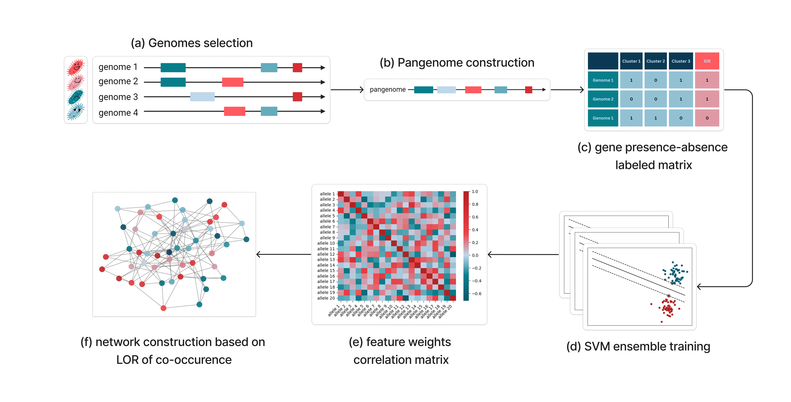

# Capstone project - Spring 2024

## _Exploring Antimicrobial Resistance Mechanisms Through a Pangenome-Scale Epistatic Interactions Network_

_date: 1/28/2024 5:23PM_
*[Mendeley paper collection*](./references.bib)

### Graphical abstract

### Abstract
Antimicrobial resistance (AMR) is a major public health issue demanding combined interdisciplinary efforts to solve it. This project aims to portray the complex gene-interaction system driving AMR mechanisms by integrating pangenomics, machine learning, and network science. 
In this work, we aim to construct a reference-agnostic pangenomic network modelling epistatic interactions between alleles defined by their co-occurence. This network will be built on a resistance based topology to demonstrate gene interactions influencing AMR mechanisms.

**Keywords:** Antimicrobial Resistance (AMR), Network Science, Epistasis, Gene-Gene Interactions, Pangenome, Association, Machine Learning, Log-Odds Ratio, Allele Co-Occurrence

### Repo organization

* src 🗂️
  * analysis 📁
    * phenotype.ipynb 📄: exploring and manipulating all the pheno data
    * memoizing_dataframes.ipynb 📄
    * {species}_{drug}_analysis.ipynb 📄: Jupyter notebook with analysis when labels are taken for this {drug}.  
  * gene_associations.py 📄
  * network_analysis.py 📄
  * network_construction.py 📄
  * cluster_analysis.py 📄
  * data_analysis.py 📄
* data 🗂️
  * phenotypes 📁
    * {species}_{drug}.csv 📄: Phenotypes for this drug and species (SIR readings) extracted from xlsx
  * processed_phenotypes 📁
    * {species}_{drug}.csv 📄: Processed phenotypes for this drug and species
  * genomes 📁
    * {species} 📁: pan genome analysis pipeline output (w/o eggnog)  
  * processed_matrices 📁
    * {species}_{drug}.csv 📄: Labeled matrix for this drug and species (concatenated X and y)
  * presence_matrices 📁
    * {species}.csv 📄: Presence matrix for this species
  * DatasetS1.json 📄
  * SIR_readings.xlsx 📄
* results 🗂️
  * {species}_{drug} 📁
    * {association_type}_top_100.csv 📄
    * {species}_{drug}_network.graphml 📄
    * annotated_{species}_{drug}_network.graphml 📄
* figures 🗂️

_needs further cleaning_
