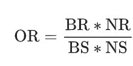
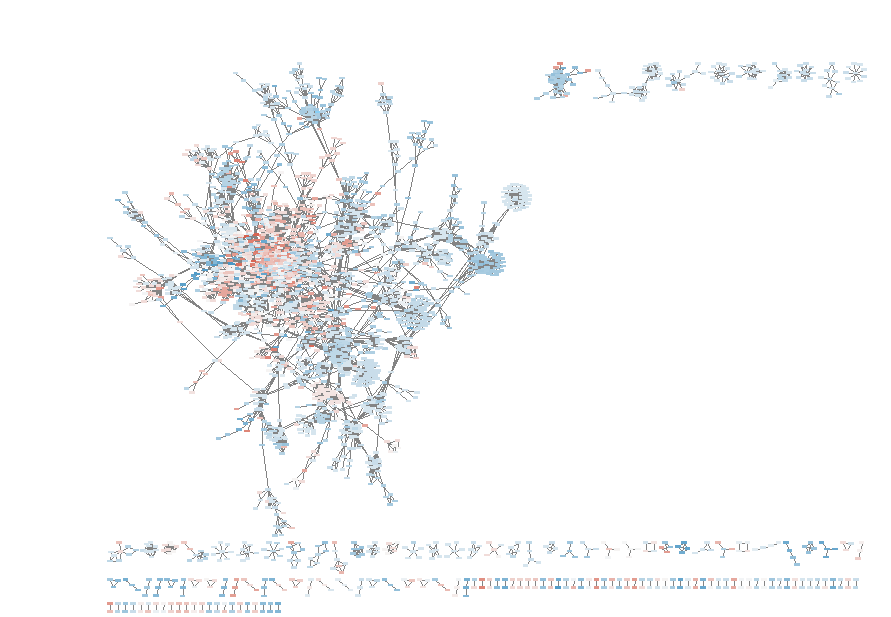
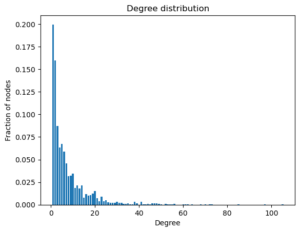
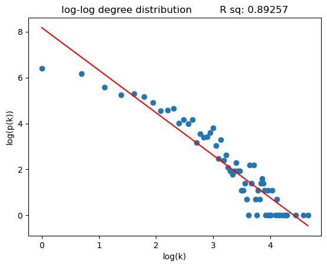
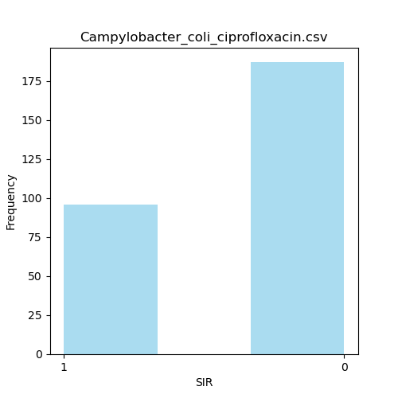

# Updates

## Network construction

### Nodes

1. Generate a GxS gene absence presence matrix from the pipeline's output (CD-Hit).  It has:  
- clusters as rows  
- samples as columns

| | sample1 | sample2 | sample3 | ... | sampleN |
|---|---------|---------|---------|-----|---------|
| cluster1 | 1 | 0 | 1 | ... | 0 |
| cluster2 | 0 | 1 | 0 | ... | 1 |
| ... | ... | ... | ... | ... | ... |
| clusterN | 1 | 1 | 0 | ... | 1 |

Clusters can be associated with an a representative gene that has a patric ID - each cluster will have a product name.   
The pipleine provides a pangenome annotation file that associates each cluster to being either core, accessory or unique.

A way to associate each cluster with resistance is by computing the odds ration of resistance (also found in a other works)

|  | resistant | susceptible |
|---|-----------|-------------|
| gene present | a | b |
| gene absent | c | d |

$log(odds) = log(\frac{a*d}{b*c})$  
_can be colored by a divergent continuous mapping when visualized_

Cluster (nodes) attributes:  
- patric_ID  
- product_name  
- log_odds  
- pan_annotation

### Edges

For edges to be defined as interactions between genes (epistatic interactions), we need to define a metric that quantifies the interaction between two genes.  
Genes in the (_transposed_) GxS presence matrix are features, hence interaction between features define the edges. 

**How to model gene-gene interaction:**  

Following the approach in Kavvas et al. (2018) that worked on gene-gene interactions while studying the resistance in _M. tuberculosis_:  

1. Started by training a 200 randomized SVM ensemble on the _alleles_ presence matrix. They took the following assumptions:  
    - weight of feature = contribution in resistance
    - positive weight = resistance & negative weight = susceptibility
    - magnitude & sign of a gene **depends** on magnitude and signs of other genes in the same hyperplane
    - randomization (they employed bootstrapping & SGD - with l1 penalty) is implemented to ensure variability of a. weights, b. signs and c. set of genes in each hyperplane for each model in the ensemble

They only took the models with AUC>0.8 now they have the following: 

|  | gene1 | gene2 | gene3 | ... | geneN |
|---|-------|-------|-------|-----|-------|
| model1 | w1 | w2 | w3 | ... | wN |
| model2 | w1 | w2 | w3 | ... | wN |
| ... | ... | ... | ... | ... | ... |
| model200 | w1 | w2 | w3 | ... | wN |

Then computed the correlation between gene weights, ending up with a GxG matrix.
Took top pairs and proceeded.

2. Each pair of genes, implemented a logistic regression model with interaction term and took the significant pairs.

<!-- logit regression -->
$y = \beta_0 + \beta_1g_1 + \beta_2g_2 + \beta_3g_1g_2$

They have accounted for colinearity by taking the follwoing measurements:  

- remove the interaction variable aibj from the logistic regression model if the presence-absence of allele ai is the same as the presence-absence of interaction aibj   
- remove both allele variables ai and bj along with the interaction variable aibj if their presence-absence is equal   
- if the presence-absence of allele ai matches the sum of all interaction variables involving that allele (aibj for all j), keep the interaction variables but remove the allele variable ai   

<!-- _have inserted them as conditions in their code BUT added a 4th condition for when there is still colinearity_ -->

**Implemented 200 SVM models without bootstrapping (don't want to take a subset of the data) & without val/test split because hte goal is not prediction (accuracy wont matter, I want to detect interaction), and without SGD as well (no variability).**  
Took all gene-gene pairs that have a correlation > 0.6 (neg and positive - signed)and proceeded.  
Ended with 102065 pairs.

**Implemented, whenever colinearity is depicted in the data, the interaction term is removed (the model not trained because it throws an error)**

Only ~150 (forgot to save the number) pairs were removed becuase of p_val<0.05 . Around 90K removed of colinearity :/

NEED TO APPLY MULTIPLE TESTING CORRECTION (they applied Benjamin-Hochberg).

Ended up with: 11328 edges.

_Not convinced with logistic regression_

**Edges attributes:**  
- correlation
- weights (SVM)
- weights (logit)

Computed ***cooccurence LOR*** for each pair of genes. 

| | resistant | susceptible |
|---|-----------|-------------|
| both present | a | b |
| both absent | c | d |

$log(odds) = log(\frac{a*d}{b*c})$

_in the paper they computed LOR of cooccurence but not defined this way - didnt understand why_  

"BR is the number of strains that have both alleles and are resistant to the specified antibiotic, NR is the number of strains that do not have both alleles and are resistant to the specified antibiotic, BS is the of strains that have both alleles and are susceptible to the specified antibiotic, NS is the number of strains that do not have both alleles and are susceptible to the specified antibiotic."

_Whenever there is a log OR computation, and to avoid getting a 0 in num/denominator, added 0.5 to each cell in the contingency table everytime there is a 0 value in teh table (they have done this)_

  

## Processed data:

Ran the pipeline on _C. ciproflaxin_ 

only this because 1. it has the least sample number: for time and memory and 2. other species are not getting to the final output of the pipeline: the emapper step is failing - same error it was giving before until some files were removed.  
However, emapper output is not incorporated so I can run for CD-hit and pan annotation.

Ciprofloxacin showed the best class balance (nalizidc acid have a similar distribution)

_some other species with other antibitics have a 50/50 class balance_

_filtering out those present at X not in y, y not in X: ended up with 267 samples_

The clusters are 8069, removing those with 0 variance (all 1s - present in all samples) ended up with 6997 clusters (6997 nodes) 