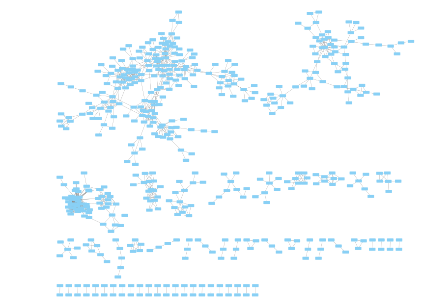

# Updates 

## Some results:

* Trying on 200 randomized SVM, |corr|<0.4 - Campylobacter coli + ciprofloxacine:
    * E: 224744, V: 6951 when 200 models are used
    * 16770 interactions have nan p-values - removed
    * Number of rejected H0: 1117 out of 207974
    * final number of nodes: 510, final number of edges: 1117

