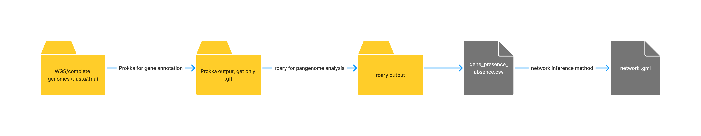
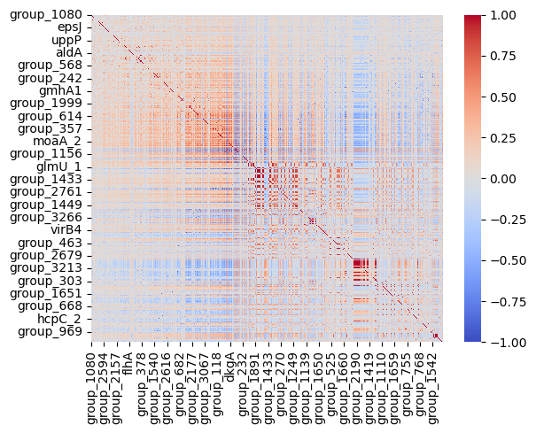
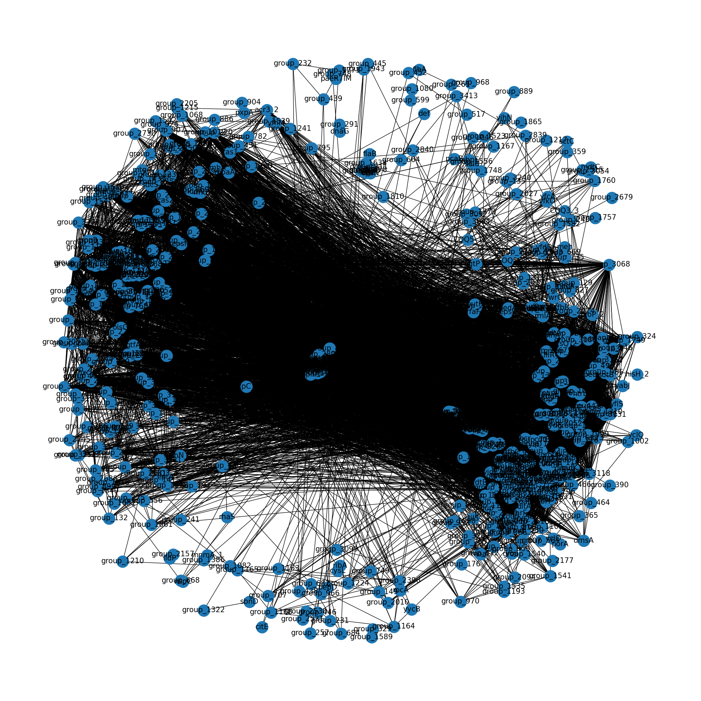
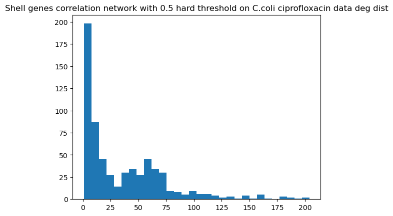
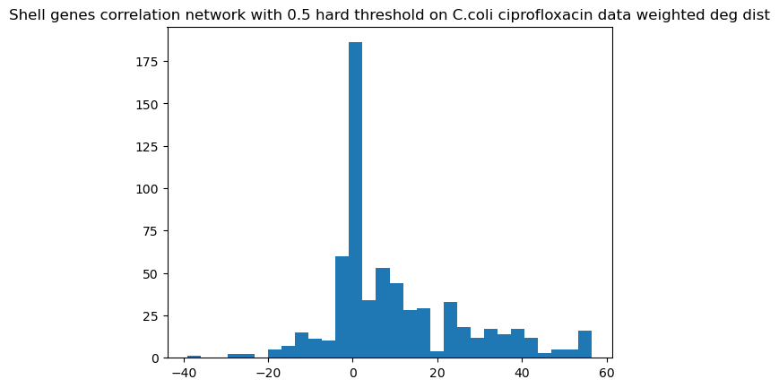

# March 21 updates

## Progress so far

### Data

- **Download**: raw data has been downloaded from PATRIC as fasta files (WGS/complete genomes), accessions has been taken from the supplementary information of this paper [1].
- **Annotation**: the genomes have been annotated using Prokka, the output is a gff file for each genome. It will move from completly raw sequences to a set of genes with their respective annotations.  
_p.s., a lot of hypothetical genes_  
- **roary**: the annotated genomes (GFF) have been used to create a pan-genome using roary, an output file is a set of genes and their presence/absence in each genome, which is of interest for the network construction.

All these steps have been automated in python and bash scripts, so that the process can be repeated for any set of genomes, all we need to provide is a text file with accession IDs.

| Species                      | Count |
|------------------------------|-------|
| Acinetobacter_baumannii.txt  | 1326  |
| Campylobacter_coli.txt       | 282   |
| Campylobacter_jejuni.txt     | 451   |
| Enterobacter_cloacae.txt     | 483   |
| Enterococcus_faecium.txt     | 1431  |
| Escherichia_coli.txt         | 3855  |
| Klebsiella_pneumoniae.txt    | 3021  |
| Neisseria_gonorrhoeae.txt    | 5961  |
| Pseudomonas_aeruginosa.txt   | 1049  |
| Salmonella_enterica.txt      | 3301  |
| Staphylococcus_aureus.txt    | 2247  |
| Streptococcus_pneumoniae.txt | 3736  |

### Metadata

- **Phenotypes**: the anti-microbial resistance phenotypes have been collected and analyzed by [1] and released as supplementary information. They moved from MIC (minimum inhibitory concentration) values, continuous, to categorical values, i.e. susceptible, intermediate, resistant, non-susceptible, non-resistant, etc. They have provided an explanation on which basis they binarized these categories (e.g., non-resistant, intermediate and suscptible are considered suceptivle - 0).  
Based on that, phenotypes have also been extracted and processed out of their excel sheet for each species, each drug. so there's a labeled  
`genome_id, phenotype` csv file for each species, each drug in a file called data/phenotypes/<species-name>_<drug-name>.csv.   
Accordingly, each network will be constructed by taking into consideration one pheno file.

247 species-drug combinations have been processed:

| Bacteria | Antibiotic | Count |
| --- | --- | --- |
| Acinetobacter_baumannii | amikacin | 938 |
| Acinetobacter_baumannii | ampicillin | 758 |
| Acinetobacter_baumannii | ampicillin_sulbactam | 826 |
| Acinetobacter_baumannii | aztreonam | 726 |
| Acinetobacter_baumannii | cefazolin | 719 |
| Acinetobacter_baumannii | cefepime | 243 |
| Acinetobacter_baumannii | cefotaxime | 706 |
| Acinetobacter_baumannii | cefotetan | 117 |
| Acinetobacter_baumannii | cefoxitin | 497 |
| Acinetobacter_baumannii | ceftazidime | 966 |
| Acinetobacter_baumannii | ceftriaxone | 865 |
| Acinetobacter_baumannii | ciprofloxacin | 1000 |
| Acinetobacter_baumannii | colistin | 127 |
| Acinetobacter_baumannii | doripenem | 203 |
| Acinetobacter_baumannii | ertapenem | 22 |
| Acinetobacter_baumannii | gentamicin | 905 |
| Acinetobacter_baumannii | imipenem | 1148 |
| Acinetobacter_baumannii | levofloxacin | 902 |
| Acinetobacter_baumannii | meropenem | 487 |
| Acinetobacter_baumannii | minocycline | 138 |
| Acinetobacter_baumannii | nitrofurantoin | 697 |
| Acinetobacter_baumannii | piperacillin_tazobactam | 156 |
| Acinetobacter_baumannii | polymyxin_b | 121 |
| Acinetobacter_baumannii | tetracycline | 805 |
| Acinetobacter_baumannii | ticarcillin_clavulanic_acid | 12 |
| Acinetobacter_baumannii | tigecycline | 307 |
| Acinetobacter_baumannii | tobramycin | 808 |
| Acinetobacter_baumannii | trimethoprim_sulphamethoxazole | 856 |
| Campylobacter_coli | azithromycin | 284 |
| Campylobacter_coli | ciprofloxacin | 284 |
| Campylobacter_coli | clindamycin | 284 |
| Campylobacter_coli | erythromycin | 284 |
| Campylobacter_coli | florfenicol | 271 |
| Campylobacter_coli | gentamicin | 284 |
| Campylobacter_coli | nalidixic_acid | 284 |
| Campylobacter_coli | telithromycin | 284 |
| Campylobacter_coli | tetracycline | 284 |
| Campylobacter_jejuni | azithromycin | 453 |
| Campylobacter_jejuni | ciprofloxacin | 453 |
| Campylobacter_jejuni | clindamycin | 453 |
| Campylobacter_jejuni | erythromycin | 453 |
| Campylobacter_jejuni | florfenicol | 453 |
| Campylobacter_jejuni | gentamicin | 453 |
| Campylobacter_jejuni | nalidixic_acid | 453 |
| Campylobacter_jejuni | telithromycin | 453 |
| Campylobacter_jejuni | tetracycline | 453 |
| Enterobacter_cloacae | amikacin | 160 |
| Enterobacter_cloacae | amoxicillin_clavulanic_acid | 2 |
| Enterobacter_cloacae | ampicillin | 54 |
| Enterobacter_cloacae | ampicillin_sulbactam | 14 |
| Enterobacter_cloacae | aztreonam | 54 |
| Enterobacter_cloacae | cefazolin | 59 |
| Enterobacter_cloacae | cefepime | 161 |
| Enterobacter_cloacae | cefotaxime | 2 |
| Enterobacter_cloacae | cefoxitin | 2 |
| Enterobacter_cloacae | ceftazidime | 2 |
| Enterobacter_cloacae | ceftriaxone | 67 |
| Enterobacter_cloacae | cefuroxime | 2 |
| Enterobacter_cloacae | ciprofloxacin | 2 |
| Enterobacter_cloacae | colistin | 3 |
| Enterobacter_cloacae | doripenem | 67 |
| Enterobacter_cloacae | ertapenem | 68 |
| Enterobacter_cloacae | gentamicin | 2 |
| Enterobacter_cloacae | imipenem | 2 |
| Enterobacter_cloacae | levofloxacin | 81 |
| Enterobacter_cloacae | meropenem | 109 |
| Enterobacter_cloacae | nitrofurantoin | 3 |
| Enterobacter_cloacae | piperacillin_tazobactam | 2 |
| Enterobacter_cloacae | tetracycline | 2 |
| Enterobacter_cloacae | tobramycin | 79 |
| Enterobacter_cloacae | trimethoprim_sulphamethoxazole | 68 |
| Enterococcus_faecium | ampicillin | 1433 |
| Enterococcus_faecium | chloramphenicol | 47 |
| Enterococcus_faecium | daptomycin | 95 |
| Enterococcus_faecium | gentamicin | 170 |
| Enterococcus_faecium | linezolid | 170 |
| Enterococcus_faecium | nitrofurantoin | 47 |
| Enterococcus_faecium | quinupristin_dalfopristin | 170 |
| Enterococcus_faecium | streptomycin | 170 |
| Enterococcus_faecium | teicoplanin | 170 |
| Enterococcus_faecium | tetracycline | 2 |
| Enterococcus_faecium | tigecycline | 170 |
| Enterococcus_faecium | vancomycin | 1433 |
| Escherichia_coli | amikacin | 601 |
| Escherichia_coli | amoxicillin | 1346 |
| Escherichia_coli | amoxicillin_clavulanic_acid | 2672 |
| Escherichia_coli | ampicillin | 2062 |
| Escherichia_coli | ampicillin_sulbactam | 192 |
| Escherichia_coli | azithromycin | 164 |
| Escherichia_coli | aztreonam | 439 |
| Escherichia_coli | cefalothin | 788 |
| Escherichia_coli | cefazolin | 343 |
| Escherichia_coli | cefepime | 599 |
| Escherichia_coli | cefotaxime | 2095 |
| Escherichia_coli | cefotetan | 114 |
| Escherichia_coli | cefoxitin | 465 |
| Escherichia_coli | ceftazidime | 2392 |
| Escherichia_coli | ceftazidime_avibactam | 93 |
| Escherichia_coli | ceftiofur | 112 |
| Escherichia_coli | ceftriaxone | 601 |
| Escherichia_coli | cefuroxime | 1907 |
| Escherichia_coli | chloramphenicol | 197 |
| Escherichia_coli | ciprofloxacin | 2492 |
| Escherichia_coli | colistin | 156 |
| Escherichia_coli | doripenem | 103 |
| Escherichia_coli | doxycycline | 120 |
| Escherichia_coli | ertapenem | 439 |
| Escherichia_coli | fosfomycin | 103 |
| Escherichia_coli | gentamicin | 2448 |
| Escherichia_coli | imipenem | 1173 |
| Escherichia_coli | kanamycin | 14 |
| Escherichia_coli | levofloxacin | 398 |
| Escherichia_coli | lincomycin | 93 |
| Escherichia_coli | meropenem | 686 |
| Escherichia_coli | minocycline | 103 |
| Escherichia_coli | nalidixic_acid | 86 |
| Escherichia_coli | nitrofurantoin | 240 |
| Escherichia_coli | norfloxacin | 187 |
| Escherichia_coli | oxytetracycline | 93 |
| Escherichia_coli | piperacillin_tazobactam | 1671 |
| Escherichia_coli | streptomycin | 163 |
| Escherichia_coli | sulfamethoxazole | 196 |
| Escherichia_coli | sulfisoxazole | 20 |
| Escherichia_coli | tetracycline | 316 |
| Escherichia_coli | tigecycline | 1510 |
| Escherichia_coli | tobramycin | 981 |
| Escherichia_coli | trimethoprim | 983 |
| Escherichia_coli | trimethoprim_sulphamethoxazole | 460 |
| Klebsiella_pneumoniae | amikacin | 2128 |
| Klebsiella_pneumoniae | amoxicillin | 3 |
| Klebsiella_pneumoniae | amoxicillin_clavulanic_acid | 137 |
| Klebsiella_pneumoniae | ampicillin | 1881 |
| Klebsiella_pneumoniae | ampicillin_sulbactam | 1605 |
| Klebsiella_pneumoniae | aztreonam | 1794 |
| Klebsiella_pneumoniae | cefalothin | 76 |
| Klebsiella_pneumoniae | cefazolin | 1897 |
| Klebsiella_pneumoniae | cefepime | 1781 |
| Klebsiella_pneumoniae | cefotaxime | 201 |
| Klebsiella_pneumoniae | cefotaxime_clavulanic_acid | 26 |
| Klebsiella_pneumoniae | cefoxitin | 2077 |
| Klebsiella_pneumoniae | ceftazidime | 2297 |
| Klebsiella_pneumoniae | ceftriaxone | 1986 |
| Klebsiella_pneumoniae | cefuroxime | 1507 |
| Klebsiella_pneumoniae | chloramphenicol | 97 |
| Klebsiella_pneumoniae | ciprofloxacin | 2090 |
| Klebsiella_pneumoniae | colistin | 94 |
| Klebsiella_pneumoniae | doripenem | 178 |
| Klebsiella_pneumoniae | doxycycline | 50 |
| Klebsiella_pneumoniae | ertapenem | 417 |
| Klebsiella_pneumoniae | fosfomycin | 54 |
| Klebsiella_pneumoniae | gentamicin | 2413 |
| Klebsiella_pneumoniae | imipenem | 2262 |
| Klebsiella_pneumoniae | levofloxacin | 1870 |
| Klebsiella_pneumoniae | meropenem | 2227 |
| Klebsiella_pneumoniae | nitrofurantoin | 1028 |
| Klebsiella_pneumoniae | norfloxacin | 113 |
| Klebsiella_pneumoniae | piperacillin_tazobactam | 1826 |
| Klebsiella_pneumoniae | polymyxin_b | 291 |
| Klebsiella_pneumoniae | tetracycline | 1983 |
| Klebsiella_pneumoniae | ticarcillin_clavulanic_acid | 113 |
| Klebsiella_pneumoniae | tigecycline | 90 |
| Klebsiella_pneumoniae | tobramycin | 1862 |
| Klebsiella_pneumoniae | trimethoprim | 112 |
| Klebsiella_pneumoniae | trimethoprim_sulphamethoxazole | 2025 |
| Neisseria_gonorrhoeae | azithromycin | 3536 |
| Neisseria_gonorrhoeae | ceftriaxone | 18 |
| Neisseria_gonorrhoeae | erythromycin | 180 |
| Pseudomonas_aeruginosa | amikacin | 590 |
| Pseudomonas_aeruginosa | aztreonam | 235 |
| Pseudomonas_aeruginosa | cefepime | 207 |
| Pseudomonas_aeruginosa | ceftazidime | 846 |
| Pseudomonas_aeruginosa | ciprofloxacin | 622 |
| Pseudomonas_aeruginosa | colistin | 466 |
| Pseudomonas_aeruginosa | gentamicin | 210 |
| Pseudomonas_aeruginosa | imipenem | 245 |
| Pseudomonas_aeruginosa | levofloxacin | 589 |
| Pseudomonas_aeruginosa | meropenem | 1016 |
| Pseudomonas_aeruginosa | piperacillin | 14 |
| Pseudomonas_aeruginosa | piperacillin_tazobactam | 197 |
| Pseudomonas_aeruginosa | tobramycin | 585 |
| Salmonella_enterica | amikacin | 95 |
| Salmonella_enterica | amoxicillin_clavulanic_acid | 1783 |
| Salmonella_enterica | ampicillin | 2472 |
| Salmonella_enterica | azithromycin | 1631 |
| Salmonella_enterica | cefotaxime | 63 |
| Salmonella_enterica | cefoxitin | 1727 |
| Salmonella_enterica | ceftazidime | 157 |
| Salmonella_enterica | ceftiofur | 1750 |
| Salmonella_enterica | ceftriaxone | 2260 |
| Salmonella_enterica | chloramphenicol | 2355 |
| Salmonella_enterica | ciprofloxacin | 2463 |
| Salmonella_enterica | colistin | 17 |
| Salmonella_enterica | furazolidone | 261 |
| Salmonella_enterica | gentamicin | 1930 |
| Salmonella_enterica | imipenem | 95 |
| Salmonella_enterica | kanamycin | 772 |
| Salmonella_enterica | nalidixic_acid | 2449 |
| Salmonella_enterica | netilmicin | 238 |
| Salmonella_enterica | spectinomycin | 286 |
| Salmonella_enterica | streptomycin | 2189 |
| Salmonella_enterica | sulfamethoxazole | 157 |
| Salmonella_enterica | sulfisoxazole | 1725 |
| Salmonella_enterica | tetracycline | 2153 |
| Salmonella_enterica | tobramycin | 95 |
| Salmonella_enterica | trimethoprim | 367 |
| Salmonella_enterica | trimethoprim_sulphamethoxazole | 2032 |
| Staphylococcus_aureus | benzylpenicillin | 149 |
| Staphylococcus_aureus | cefoxitin | 1042 |
| Staphylococcus_aureus | chloramphenicol | 838 |
| Staphylococcus_aureus | ciprofloxacin | 1726 |
| Staphylococcus_aureus | clindamycin | 723 |
| Staphylococcus_aureus | daptomycin | 122 |
| Staphylococcus_aureus | erythromycin | 2015 |
| Staphylococcus_aureus | fosfomycin | 313 |
| Staphylococcus_aureus | fusidic_acid | 1997 |
| Staphylococcus_aureus | gentamicin | 2007 |
| Staphylococcus_aureus | kanamycin | 62 |
| Staphylococcus_aureus | levofloxacin | 257 |
| Staphylococcus_aureus | linezolid | 892 |
| Staphylococcus_aureus | methicillin | 868 |
| Staphylococcus_aureus | mupirocin | 1269 |
| Staphylococcus_aureus | oxacillin | 410 |
| Staphylococcus_aureus | penicillin | 1119 |
| Staphylococcus_aureus | rifampicin | 1752 |
| Staphylococcus_aureus | teicoplanin | 151 |
| Staphylococcus_aureus | tetracycline | 1752 |
| Staphylococcus_aureus | tobramycin | 63 |
| Staphylococcus_aureus | trimethoprim | 501 |
| Staphylococcus_aureus | trimethoprim_sulphamethoxazole | 338 |
| Staphylococcus_aureus | vancomycin | 1105 |
| Streptococcus_pneumoniae | amoxicillin | 170 |
| Streptococcus_pneumoniae | cefotaxime | 433 |
| Streptococcus_pneumoniae | ceftriaxone | 3424 |
| Streptococcus_pneumoniae | cefuroxime | 170 |
| Streptococcus_pneumoniae | chloramphenicol | 247 |
| Streptococcus_pneumoniae | ciprofloxacin | 170 |
| Streptococcus_pneumoniae | clindamycin | 355 |
| Streptococcus_pneumoniae | erythromycin | 495 |
| Streptococcus_pneumoniae | levofloxacin | 170 |
| Streptococcus_pneumoniae | linezolid | 170 |
| Streptococcus_pneumoniae | meropenem | 301 |
| Streptococcus_pneumoniae | penicillin | 3511 |
| Streptococcus_pneumoniae | quinupristin_dalfopristin | 170 |
| Streptococcus_pneumoniae | rifampicin | 170 |
| Streptococcus_pneumoniae | tetracycline | 404 |
| Streptococcus_pneumoniae | trimethoprim_sulphamethoxazole | 3253 |
| Streptococcus_pneumoniae | vancomycin | 170 |

## Building the network

### network type: `correlation`  
Inspired by **Weighted Gene Co-expression Network**, we use the correlation between genes as the edge weight. The correlation is calculated using the Pearson correlation coefficient.  

**Input**: a matrix of genes (rows) and samples (columns) `(GxS)` with 1s and 0s indicating the presence/absence of a gene in a genome.

**Output**: a network with genes as nodes and the correlation between them as edge weights.

Some nodes have to be filtered out, particularly those which are either present in all samples or very rarely present. Why? they would have either 1/0 correlation value with all other genes, which is not informative.  
Proposing target nodes for removal:
- **core and soft-core genes**: genes that are present in more than 95% of the samples.
- **cloud genes**: genes that are present in less than 15% of the samples.  

Can try different combinations of these threshholds.

Keeping only the **shell genes**, present in 15<=x<=95% of the samples.

Corr of shell genes

Network construction:  

  - **Thresholding**: two types of thresholds can be used to construct the network.  
    - **Hard thresholding**: A hard threshold is used to remove weak edges from the network, i.e. _only keep edges > 0.5 corelation (+ or -)_.

    

    

    

    | Network | N | V | Density | <k> | <k> weighted | <cc> | <spath> | d |
    |---------|---|---|---------|-----|--------------|------|---------|---|
    | Shell genes correlation network with 0.5 hard threshold on C.coli ciprofloxacin data | 643 | 11482 | 0.055629 | 35.713841 | 10.145719 | 0.695407 | 3.307834 | 12 |

    - **Soft thresholding**: A soft threshold is used to transform the correlation matrix into a weighted adjacency matrix. The soft threshold is chosen such that the resulting network is approximately scale-free (there's a package in R WGCNA that can be used to calculate the soft threshold, common practice to use the _pickSoftThreshold_ function to choose the soft threshold), this way we raise the cor values to a power (which is the parameter we're looking for) and then we use the resulting matrix to construct the network,   
    _i.e. get edge weight=_ $corr^{beta}$ _such that beta is the lowest power that transforms the adjacency matrix into a power law distribution._

