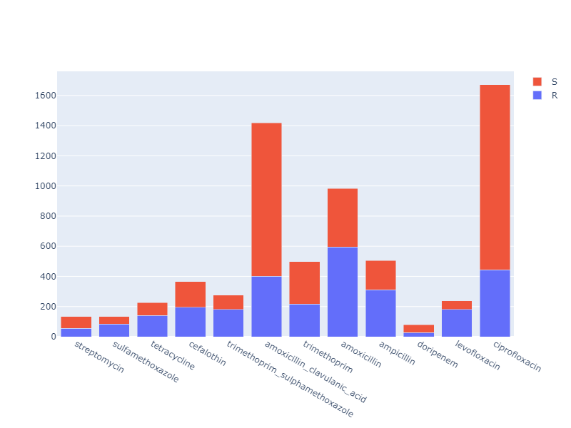
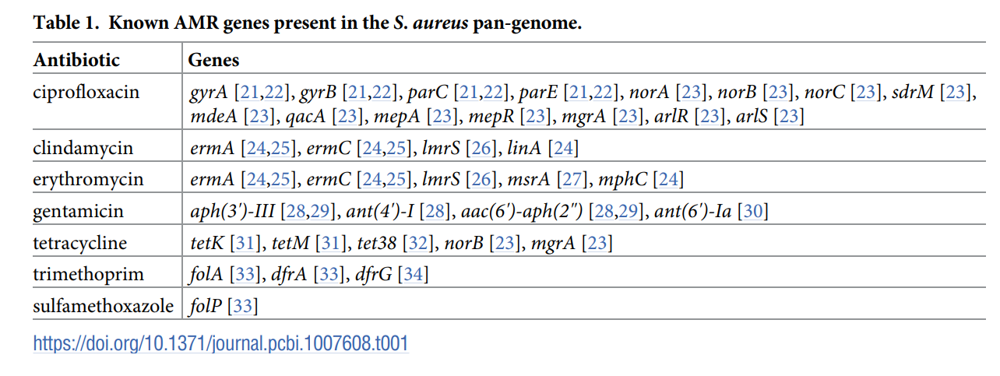

# Very Brief Summary

## 1. Data

### Genomes

| Species | Number of samples | Number of clusters in pangenome | Number of clusters after filtration |
| ------- | ----------------- | ------------------------------- | ----------------------------------- |
| E. coli | $1970^1$ from PATRIC | 90941                           | $18875^2$                            |

$^1$: the original list that is filtered based on Hyun et al. (2021) contains 3856 samples (representing all the E. coli genomes from PATRIC that meet certain requirements including completness and such).
Extracting the 3856 wasn't successful (waited a week before killing it, last days was barely downloading anything new). Why these particular 1970? Not sure. Found these genome ids within the pipeline on github which are out of these 3856, ran it ffor trial, were downloaded successfully with a pipeline run within days.

$^2$: filtration was done to remove a. hypotheticals, b. unknowns, and c. clusters that are present in less tahn 5 genomes (why 5? commonly taken threshold in several papers)

Running the pipelien we can extract the following for each cluster:
- pan annotation (core, accessory, unique)  
- frequency  
- product (gene function)  
- PATRIC ID of the cluster

### Phenotypes

For one species (_E. coli_) there are 45 phenotypes available (45 different antibiotics with SIR readings like the following example)

| Genome ID | SIR |
| --------- | --- |
| sample 1  | S   |
| sample 2  | R   |

(these were processed out of the supp info of one of the papers)

Not all the 1970 genomes have readings, some have missing values, some are for otehr genomes hence to filter out and keep valid antibiotics followed 2 criteria:  
- at least 50 readings per antibiotic  
- a max class imbalance of 80/20

Ending up with 12 antibiotics.

Now for each antibiotic, in order to validate the results, what papers usually do is have a list which antibiotic resistance genes (ARGs) which are key players in resisatnce for each drug/antibiotic.  
This list is typically done by literature review and expert knowledge...  

Instead, here, I used the PATRIC API to extract speciality genes with antimicrobial resistance property - from 3 sources: CARD, NDARO, and PATRIC itself (top 3 AMR dbs)

Ended up having this list for E. coli, out of the genomes we have:  

| Antibiotics                       | ARGs                                                                                                          |
|-----------------------------------|---------------------------------------------------------------------------------------------------------------|
| streptomycin                      | 'rpsL', nan, 'neo', 'gidB', 'fyuA', 'aph(6)-I', 'APH(6)-Ic/APH(6)-Id', 'S12p', "APH(3'')-I", 'aadA', 'strA_1', 'strA_2', 'aadA1', 'strA'             |
| sulfamethoxazole                  | nan, 'sul1', 'sul2', 'folP', 'MexAB-OprM', 'sul3', 'folP2', 'sulI', 'acrB_1', 'mexB_2', 'mexB_1', 'mexB'                                                                    |
| tetracycline                      | nan, 'cmr', 'ybhT', 'tetA', 'acrR_1', 'mdfA', 'emrB', 'emrY', 'tolC', 'rpsJ', 'tetD', 'emrK', 'acrR', 'marR', 'fyuA', 'acrA', 'tetC', 'hns', 'marA', 'acrB', 'MarB', 'S10p', 'AcrAB-TolC', 'H-NS', 'EmrKY-TolC', 'MarR', 'MdfA/Cmr', 'AcrZ', 'MarA', 'Tet(A)', 'MexAB-OprM', 'Tet(B)', 'emrB_2', 'acrB_1', 'emrB_1', 'marB', 'mexB_2', 'hns_1', 'hns_2', 'marA_1', 'marR_2', 'mexB_1', 'mexB', 'marR_1', 'acrB_2' |
| cefalothin                        | nan, 'ybhT', 'acrR_1', 'acrR', 'marR', 'acrA', 'marA', 'acrB', 'MarB', 'AcrAB-TolC', 'MarR', 'AcrZ', 'MarA', 'marB', 'marA_1', 'marR_2', 'acrB_1', 'marR_1', 'acrB_2'              |
| trimethoprim                      | nan, 'folA', 'folA, Dfr', 'MexAB-OprM', 'folA_1', 'acrB_1', 'dhfrV', 'mexB_2', 'dhfrI', 'dfrD', 'dfrA', 'mexB_1', 'mexB', 'folA_2'                                              |
| amoxicillin                       | nan, 'blaT-6', 'blaTEM', 'OXA-1 family', 'TEM family', 'MexAB-OprM', 'NDM family', 'acrB_1', 'mexB_2', 'bla', 'bla_2', 'mexB_1', 'mexB', 'bla_1'                                 |
| ampicillin                        | nan, 'ybhT', 'bla_1', 'acrR_1', 'blaT-6', 'acrR', 'marR', 'fyuA', 'acrA', 'blaTEM', 'marA', 'acrB', 'MarB', 'AcrAB-TolC', 'MarR', 'AcrZ', 'MarA', 'TEM family', 'MexAB-OprM', 'SHV family', 'acrB_1', 'marB', 'mexB_2', 'bla', 'marA_1', 'bla_2', 'marR_2', 'mexB_1', 'mexB', 'marR_1', 'acrB_2' |
| levofloxacin                      | 'gyrA', nan, 'gyrB', 'QnrB family'                                                                             |
| ciprofloxacin                     | nan, 'mfd', 'gyrA', 'ybhT', 'acrF', 'gyrB', 'msbA', 'acrA', 'hns', 'acrB', 'AcrAB-TolC', 'AcrEF-TolC ', 'H-NS', 'AcrZ', 'QnrB family', 'MexAB-OprM', 'acrE', 'acrB_1', 'mexB_2', 'hns_1', 'hns_2', 'mexB_1', 'mexB', 'acrB_2' |

_The nans dont have gene names but there's always a product name (which will be used in analysis anyway due to limited gene naming)_

can remove the drugs with no ARGs (trimethoprim_sulphamethoxazole, amoxicillin_clavulanic_acid, doripenem)
Ending up with 12 antibiotics (also common range in lterature for such studies when performing AMR prediction on a species)

Ended up with more ARGs then they did through extensive lit review haha :p

## 2. Analysis

### Validation

Looking at these 2 papers: [1] and [2], a common thing they both do is use statistical approaches that were used before to associate genomes with AMR phenotypes and then use their machine learning approaches and compare results.  
This way of validating will ensure comparability having the same data (can not compare with literature because they work with different genomes... so i compare the different approaches on my data)

One of them have tabulated results this way (through ranks):

What and why: 

They get top 100 genes associated with an antibiotic resistance phenotype (based on statistical approaches like Mutual Information that takes a gene presence vector and a label vector and associates it outputting a score)  
Then they compare the top 100 genes with the ARGs they have from literature review, and see where they are ranked 

One of them proved that calculating feature importance our of SVM ensemble sum of weights turned out to be better than MI, chi sq and ANOVA. 

The plan is to do something similar with network metrics. The aim behind it will be addressing a limitation found everywhere in AMR research and it's: not accounting for epistasis (gene interactions - genes on their own to not dictate resistance, it's a complex system )

So we would have something like 

|           | ARG_1 | ARG_2 | ... | ARG_n | 
|-----------|-------|-------|-----|-------|
| MI        | rank  | rank  | ... | rank  |
| SVM       | rank  | rank  | ... | rank  |
| ...       | ...   | ...   | ... | ...   |
| betweeness centrality | rank  | rank  | ... | rank  |
| degree centrality | rank  | rank  | ... | rank  |
| ...       | ...   | ...   | ... | ...   |

can: 

- count which ecompassed the most ARGs in the top 100   
- make a score out of the ranks ( The Rank Based Sum Method)

Mainly will try: MI, chi squared and ANOVA. other than that will try SVM ensemble sum of weights.

And this would be a good closure for the project. The main work is defining a network meaningfully enough to capture interaction and produce valid results.

### Network Construction:

Things that don't work: 

- co-occurence network  
- weighted gene corelation network (corr of presence)
- SVM ensemble corelation network (capturing feature interaction)  
- ANN hidden layer corelation network (capturing feature interaction)  
- Logistic regression interaction network (capturing feature interaction)  
- 2 way ANOVA interaction network (capturing feature interaction)  
- Friedman's H-test for feature interaction (capturing feature interaction)

Final resort to ensure that nodes will be important nodes and interaction will be both meaningful and not too sparse:  

- get the top 1000 genes (feature importance, can use SVM ensemble sum of weights for that or any ML/stats method => can use the one that proved to be best in the table above if have time)  
- there will be ~500k pairs of genes to test interaction on  
- for each pair calculate teh LOR of co-occurence which will be defined this way:  

$LOR_{coocc} = \log\left(\frac{\frac{num R samples\ they\ cooccur\ in}{(1 - num R samples\ they\ co-occ\ in)}}{\frac{num S samples\ they\ cooccur\ in}{(1 - num S samples\ they\ co-occ\ in)}}\right)$

(defined differently in [1] but don't understand why)

- then filter out the pairs that have |LOR|<0.5 (common threshoshold in epidemeology where LOR is a common metric, don't know if there is a consensus for anything else but couldn't find any)

## Main References

[1] Kavvas, E. S., Catoiu, E., Mih, N., Yurkovich, J. T., Seif, Y., Dillon, N., ... & Palsson, B. O. (2018). Machine learning and structural analysis of Mycobacterium tuberculosis pan-genome identifies genetic signatures of antibiotic resistance. Nature communications, 9(1), 4306.

[2] Hyun, J. C., Kavvas, E. S., Monk, J. M., & Palsson, B. O. (2020). Machine learning with random subspace ensembles identifies antimicrobial resistance determinants from pan-genomes of three pathogens. PLoS computational biology, 16(3), e1007608.

